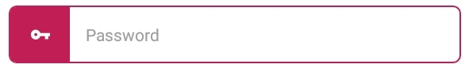

# IconicTextbox
This component renders beautiful textboxes for both ios and android.

<p align="left">

</p>

## Installation and Use
- **Step 1:** Install with npm or yarn... **DO NOT REPEAT IF INSTALLED ALREADY**
```
$ npm i iconic-input --save

----- OR -----

$ yarn add iconic-input
```
- **Step 2:** Import IconicTextbox from *iconic-input*
```
import { IconicTextbox } from 'iconic-input'
```
- **Step 3:** Start using it! (Props enabled)
```
    render(){
        return(
            <View>
                <IconicTextbox />
            </View>
        )
    }
```

## Props and Use
| Props           | Type               | Description                                              | Default           |
|-----------------|--------------------|----------------------------------------------------------|-------------------|
| maxLength       | integer            | Maximum letters allowed in an Input.                     | 30                |
| secureTextEntry | boolean            | Used for showing Hidden input. (Passwords)               | false             |
| autoCorrrect    | boolean            | Whether or not to allow autoCorrect                      | false             |
| icon            | string             | Name of Icon in Ionicons Library                         | globe             |
| iconColor       | string: hex code   | The color of the icon                                    | black             |
| colorTheme      | string: hex code   | The color of IconicTextbox                               | #87ceeb           |
| rounded         | boolean            | Whether or not the Textbox has a round border            | false             |
| iconPosition    | string: left/right | Determines whether the icon position is in left or right | right             |
| placeholder     | string             | Label in TextInput.                                      | Custom Text Input |
| value           | TextInput Prop     | -                                                        | -                 |
| OnChangeText    | callback           | Triggers when text in TextInput is changed.              | -                 |

**All the icons and their names can be found at [Ionicons official website](https://ionicframework.com/docs/ionicons/)**

## Example
**Code:**
```
    <IconicTextbox
        placeholder = "Password"
        icon = "key"
        iconColor = "white"
        colorTheme = "#ff033e"
        iconPosition = "left"
        rounded
    />
```

**Result:** <br /><br />



