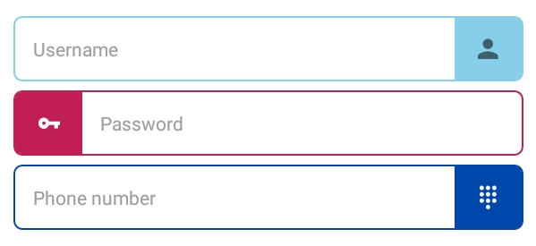

# Iconic Input (iconic-input)
A library of Iconic and Beautiful React Native Input and Editing components such as ***IconicTextbox***.
---
Yet, this library only contains one Iconic React Native Input Component. That is, IconicTextbox which looks as cool as these:

<center>



</center>

___

## Installation
- **Step 1:** Install with npm or yarn
```
$ npm i iconic-input --save

----- OR -----

$ yarn add iconic-input
```
- **Step 2:** Import *IconicTextbox*
```
import { IconicTextbox } from 'iconic-input'
```
- **Step 3:** Start using it!
```
render(){
    return(
        <View>
            <IconicTextbox />
        </View>
    )
}
```

## Props and Use
| Props           | Type               | Description                                              | Default           |
|-----------------|--------------------|----------------------------------------------------------|-------------------|
| maxLength       | integer            | Maximum letters allowed in an Input.                     | 30                |
| secureTextEntry | boolean            | Used for showing Hidden input. (Passwords)               | false             |
| autoCorrrect    | boolean            | Whether or not to allow autoCorrect                      | false             |
| icon            | string             | Name of Icon in Ionicons Library                         | globe             |
| iconColor       | string: hex code   | The color of the icon                                    | black             |
| colorTheme      | string: hex code   | The color of IconicTextbox                               | #87ceeb           |
| rounded         | boolean            | Whether or not the Textbox has a round border            | false             |
| iconPosition    | string: left/right | Determines whether the icon position is in left or right | right             |
| placeholder     | string             | Label in TextInput.                                      | Custom Text Input |
| value           | TextInput Prop     | -                                                        | -                 |
| OnChangeText    | callback           | Triggers when text in TextInput is changed.              | -                 |

**All the icons and their names can be found at [Ionicons official website](https://ionicframework.com/docs/ionicons/)**

## Development and Contribution
Currently, it just has one Component as illustrated. Later, more input components and their iconic designs will be added.
---
This repository accepts all types of added innovation. It is open source.
If you want to contribute to this project, **just fork this project and drop a pull request.**

## License
Why the fuck does an open source software need any license? Well, **This repo is GPL licensed** for no better reason.